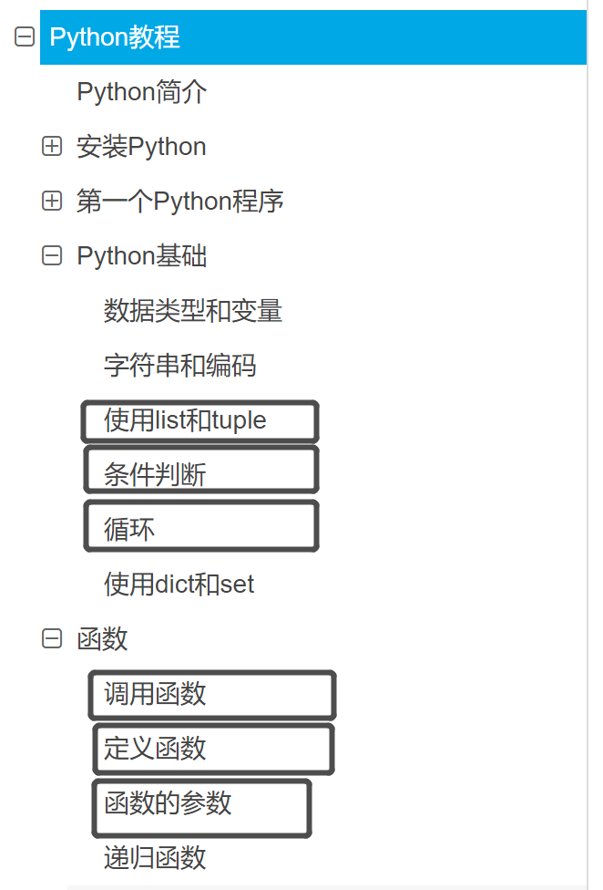
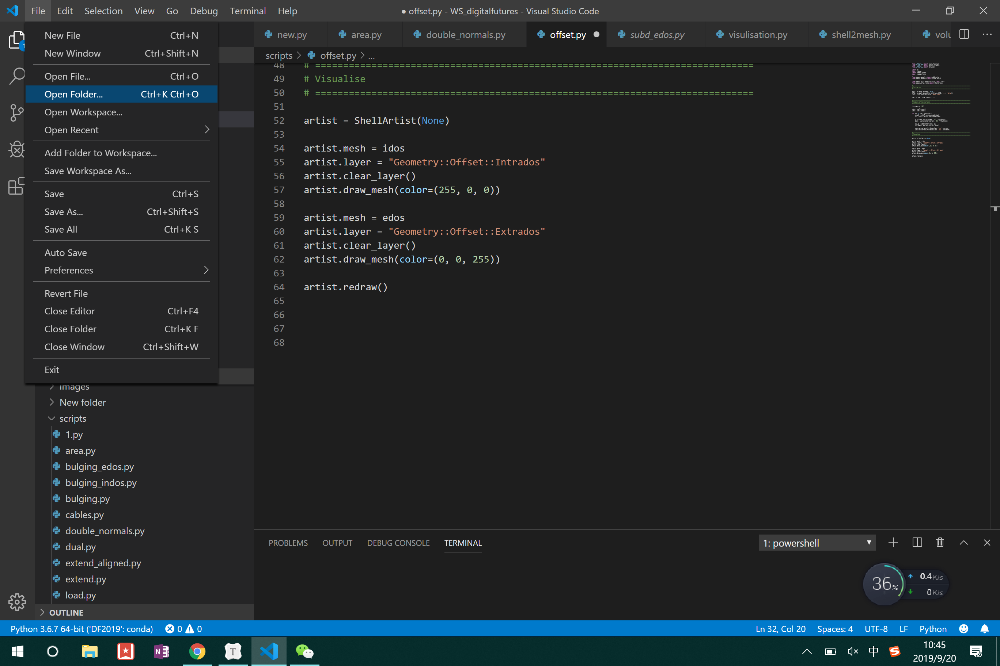
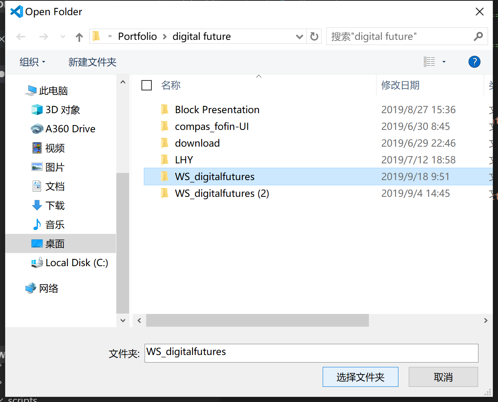
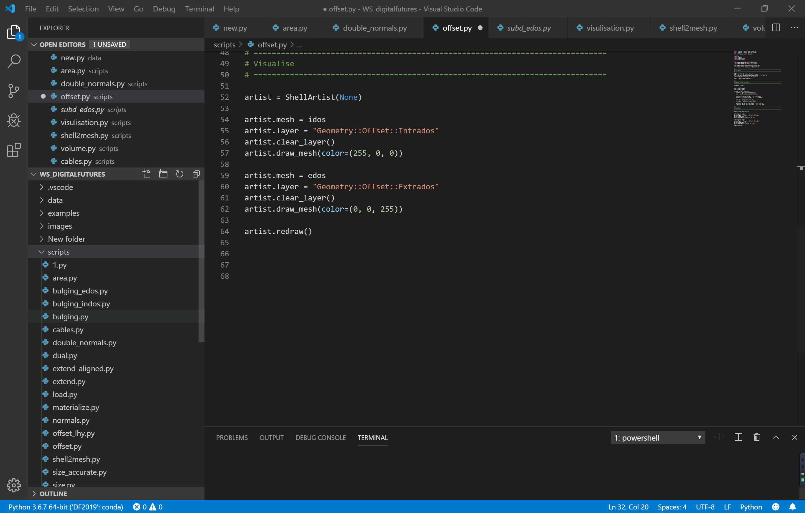
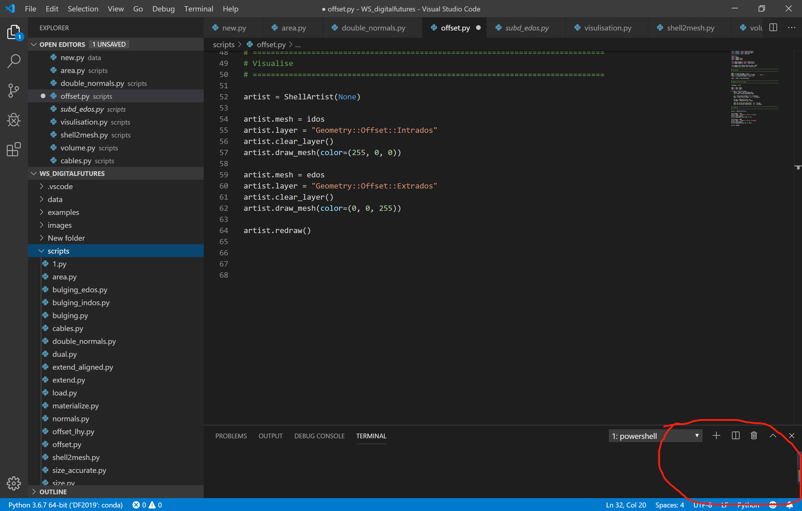
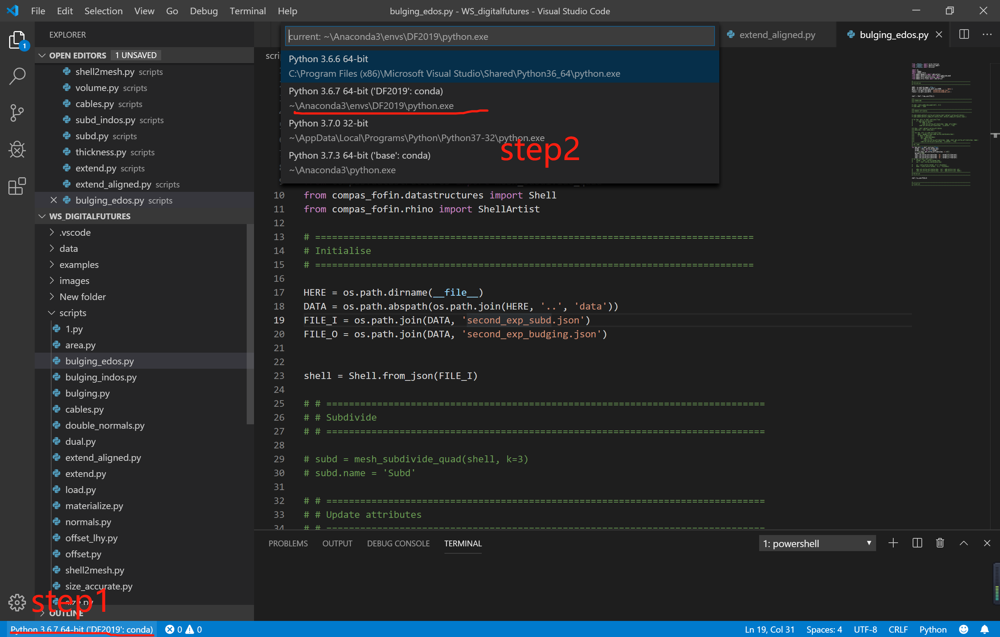
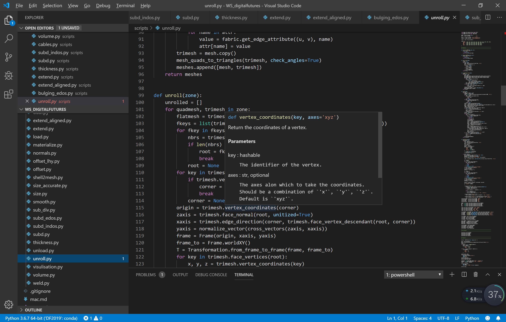
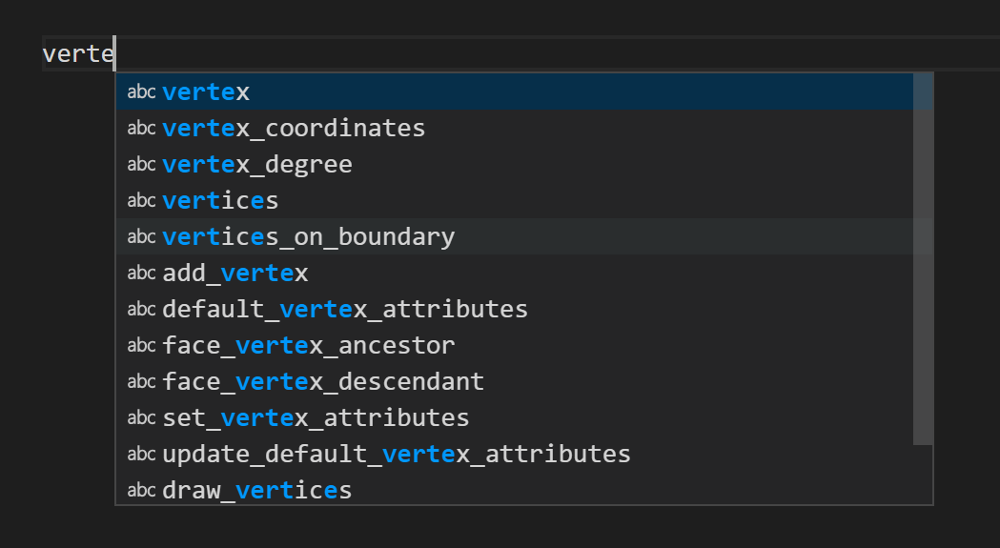

# COMPAS编程——1


## 基础Python编程

基础python教程：https://www.liaoxuefeng.com/wiki/1016959663602400



重点看灰线圈出的部分，请一定要跟做一下。


## 编写环境和运行环境

编写环境是之前下载的Visual Studio Code。（注意不是Visual Studio）

File—Open Folder



选择工作坊文件夹，并单击选择文件夹



点开script里有我们即将用到的程序



在右下角的位置会弹出各种警告要求你安装各类插件，请按照提示都将其安装。



在安装完python插件后，点击左下角选择Python Interpreter。（Python解释器）



然后随便打开一个代码，就可以看到上面的代码提示和解读



在输入函数的时候会有自动补全



而运行环境在rhino里，在rhino 里输入命令EditPythonScript


打开刚刚文件里的程序


点击运行即可


### 小作业，写一个算圆的面积的程序

(此作业需要你跟廖雪峰的教程跟到函数部分才可以)

在VS code里选择新建文件，命名 1.py


算圆的面积需要用到Pi，所以我们先import一个math的函数组

```
import math
```

定义一个计算圆的函数

```
def area_circle(r,a=1):
    S=r*r*a*math.pi
    return S
```


这一行的意思是定义一个函数，r需要给予赋值，a也可以赋值（a变量在这里表示圆的“长”与“宽”的比值）

```
def area_circle(r,a=1):
```

下一行的写面积公式

```
    S=r*r*a*math.pi
```

也可以写成

```
	S=r**2*a*math.pi
```

（**在python里表示指数，写^不行，是另一个函数，前面的四个空格在python里在上一行有冒号的情况下会自动往后退4格，没有冒号的情况下退格与上一行保持一致，需要自己键入的时候按Tab键，shift+Tab键取消4个退格）


然后设定函数返回S的值

```
    return S
```


此时引用刚刚写好的S 函数求面积，并输出S的值

```
S=area_circle(1,2)
print(S)
```

Ctrl+s保存后，在rhino里打开


点击绿色的播放键得到结果


# OFFSET程序编写

## 准备工作

### 保证正反面的连续性

在着色模式里将背面着色区分正反面


可以看到正反面并不连续，需要将其调整到连续，不然法向就会相反


选择标准里面的这个命令进行翻转


调整到这样


用半透明模式再给大家展示一下


输入命令join


打开grasshopper

##### 安装插件（已经安装的可以省略这一步）

打开component folder，将这里下载的文件解压到立面

链接：https://pan.baidu.com/s/1NFYZ0kpy-1EqeYoq8ghHtQ 
提取码：e7qq 
复制这段内容后打开百度网盘手机App，操作更方便哦


保存3dm，重新打开rhino和gh


把这个电池bake出来到一个新图层


FOFIN_FROM   选择bake出来的mesh（记得先fofin_run，有问题的电脑记得在anaconda里做好步骤先）


FOFIN_attributes,选择固定的瞄点


把is_anchor改成True


Fofin_run


### Shell（壳体）的储存（serialize）

建立一个文件夹长这样


在rhino里fofin_serialise存到data里


命名

```
1.json
```


把原工作坊的文件里的scripts文件复制到这里，也可以从这里下载

链接：https://pan.baidu.com/s/1I3fLEAhRKnbrdD5gGLkIpQ 
提取码：ztnb 
复制这段内容后打开百度网盘手机App，操作更方便哦


## 开始编程

### 创建程序

open folder


打开刚刚创建的文件夹


在scripts里新建文件命名 offset_yournamehere.py


### 壳体文件输入到代码中

（以下内容我会把整个编程的过程和思路都写清楚，请大家不要复制代码块的代码，而是尝试按照指示自己每个字母都敲出来，这样才会真的有提高）


在程序的抬头敲出这几行代码，几乎这里写的每一种代码都会用到这些（请将这些代码保持在抬头）

```
from __future__ import print_function
from __future__ import absolute_import
from __future__ import division
```


这一块的意思是将现在的网格输入到程序里。


写好注释便于以后阅读（#后的内容实际程序中不会运行，可以用ctrl+/批量注释或者取消注释）

```
# ==============================================================================
# Initialise
# ==============================================================================
```

在这里我们要用os的类来写文件的输入操作，所以需要在前面import这一模块


```
importos
```


os.path.dirname写的是在这个py程序文件的地方找文件目录。


```
HERE = os.path.dirname(__file__)
```


os.path.abspath 是在这个文件夹下要找到data文件夹


```
DATA = os.path.abspath(os.path.join(HERE, '..', 'data'))
```


os.path.join是将data下1.json导入FILE_I里（这里的1.json要改成你打算处理的文件的名字）


```
FILE_I = os.path.join(DATA, '1.json')
```


现在需要调用compas类的函数将json里的文件信息解码为图形文件。

在程序前写上这些


这里要用到Shell.from_json 函数，所以在前面输入


然后再将json文件里的解码储存在shell变量里


```
shell = Shell.from_json(FILE_I)
```


到目前为止我们完成了将图形文件input的过程，这个部分相关的代码是


接下来要对图形进行处理

### 图形处理

#### 整体代码


#### 整体思路：


我们将壳体复制，然后将图形中的每个点都沿着法向外移（和内移），就得到了offset后的图形

值得一提的是，图形中的每一个点都有一个key值，选取点，在名称处可以看到点的key


在compas中，每个点的各个属性其实是通过dictionary的方式来储存的（忘了的回去看廖雪峰的教程），然后再通过调用key的方式来调用点的各个属性进行更改。


首先我们输入厚度值，单位是米。


```
thickness = 0.02
```

再将现有的图形复制为里外两层，后续再编辑


```
edos = shell.copy()
idos = shell.copy()
```

对于每一个key值的点都要进行处理，这里采用遍历循环的方式


```
for key in shell.vertices():
```

我们需要求每个点的法向，法向的英文是normal，我们在compas官网和compas_fofin的documentation里查一下相关函数

https://compas-dev.github.io/main/index.html

https://blockresearchgroup.github.io/compas_fofin/


compas_fofin是比compas更进一步为我们找型定制的函数，有compas_fofin的函数就用compas——fofin的函数。


这个函数直接通过key值可以提取该点的法向，非常理想。（法向长度默认为1）

由于我们之前已经写过

所以这里normal的值直接提取：

```
normal = shell.vertex_normal(key)
```

同时我们要提取各点的坐标值（用英文coordinate在官网找到这个函数）


需要注意的是，这个函数返回的值是一个[x,y,z]的list，应写成xyz


```
xyz = shell.vertex_coordinates(key)
```


因为上下偏移的距离应该为厚度的一半，所以需要对向量进行缩放

先在前面引入缩放向量的函数


```
from compas.geometry import scale_vector
```


函数第一个变量是向量xyz的list，factor是缩放值


```
    up = scale_vector(normal, 0.5 * thickness)
    down = scale_vector(normal, -0.5 * thickness)
```

（其实normal本身是一个list你直接写成这样也成：

```python
    up=[]

    up.append(0.5*normal[0])
    up.append(0.5*normal[1])
    up.append(0.5*normal[2])

    down=[]
    up.append(-0.5*normal[0])
    up.append(-0.5*normal[1])
    up.append(-0.5*normal[2])
```


之后对坐标值进行偏移，分别储存为xyz_up 和xyz_down

引入一个函数叫add_vectors


就是把向量和坐标值加起来

```
    xyz_up = add_vectors(xyz, up)
    xyz_down = add_vectors(xyz, down)
```

那么很明显xyz_up 和xyz_down，应该是里外两层壳体对应当前key值的点的新的坐标值。

然后我们将里外两层的对应点的xyz值改一下，用到的函数是


```
    edos.set_vertex_attributes(key, 'xyz', xyz_up)
    idos.set_vertex_attributes(key, 'xyz', xyz_down)
```

因为前面已经设定了edos和idos的数据类型是shell，所以这里edos.set_vertex_attributes就会自动引入到shell.set_vertex_attributes


然后这一部分就完成了，经过遍历之后，edos和idos这两个shell的每个点都发生了偏移

### 可视化

可视化是每个程序都会有的小尾巴，编程方法大同小异，这里直接用注释解释一下了


在rhino的python编辑器里打开


点击绿色播放按钮，应出现：


## 小作业

参考normals.py将每个点的法线可视化的程序写出来，不用复制粘贴，一定要弄懂输入层和代码层的意思，每个命令都要在官网查一下。

其效果应该如下图。


要求：绿色箭头不可以太短（所以和normals.py不完全一样）