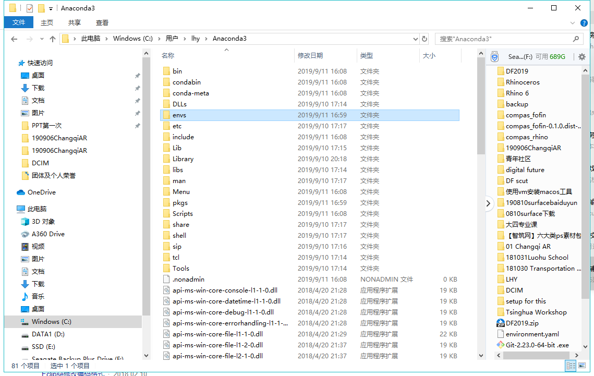
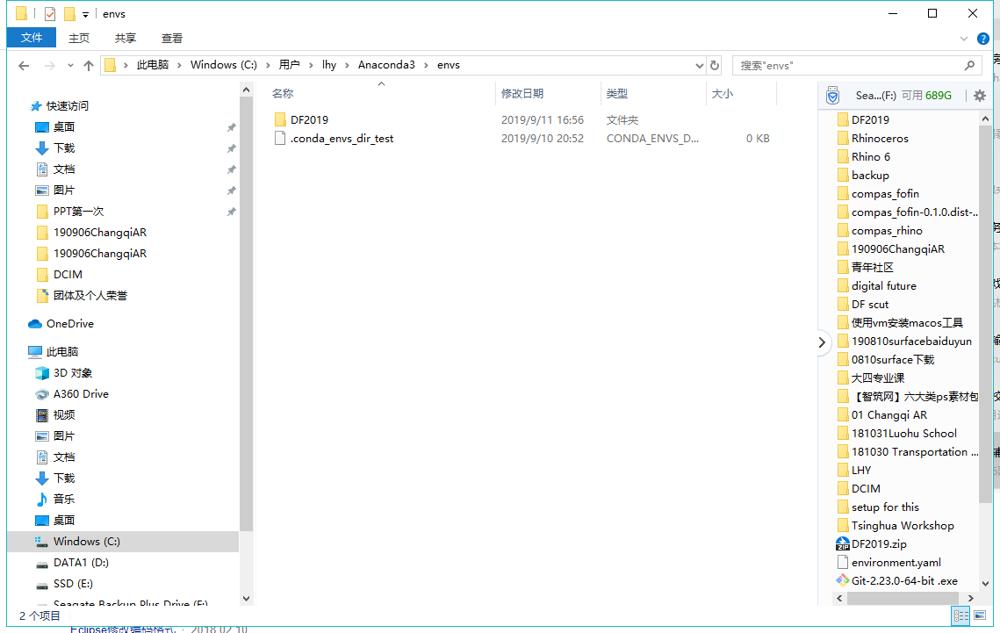
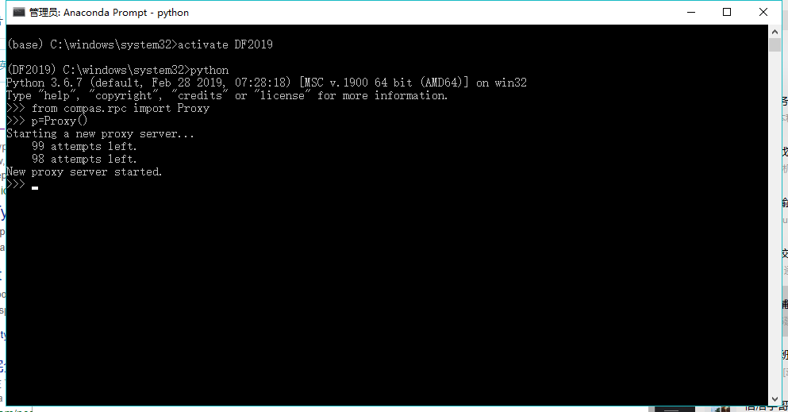
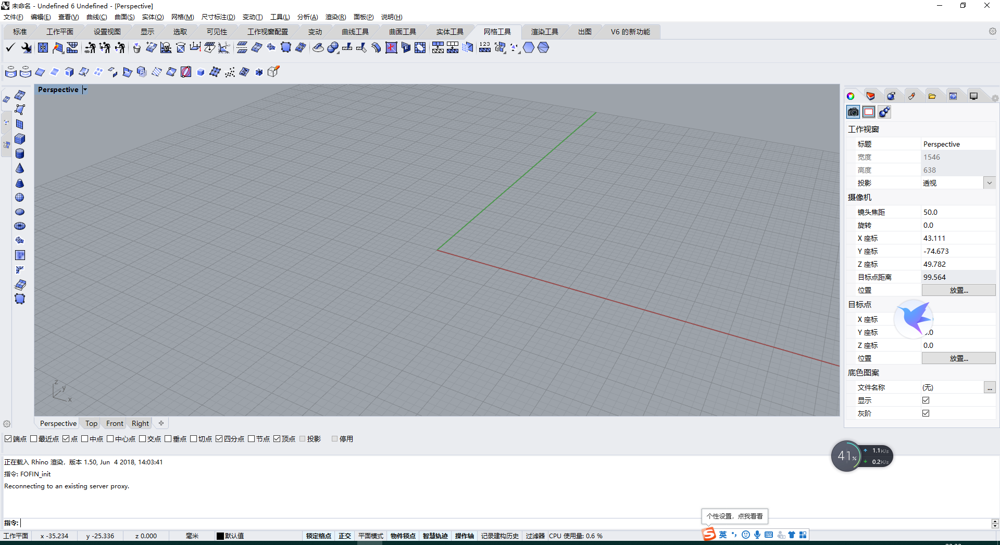
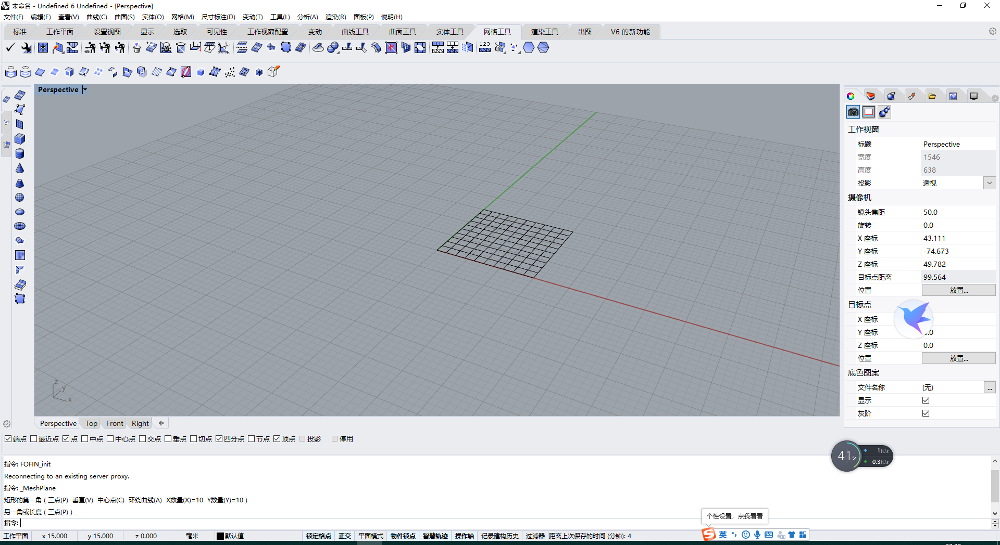
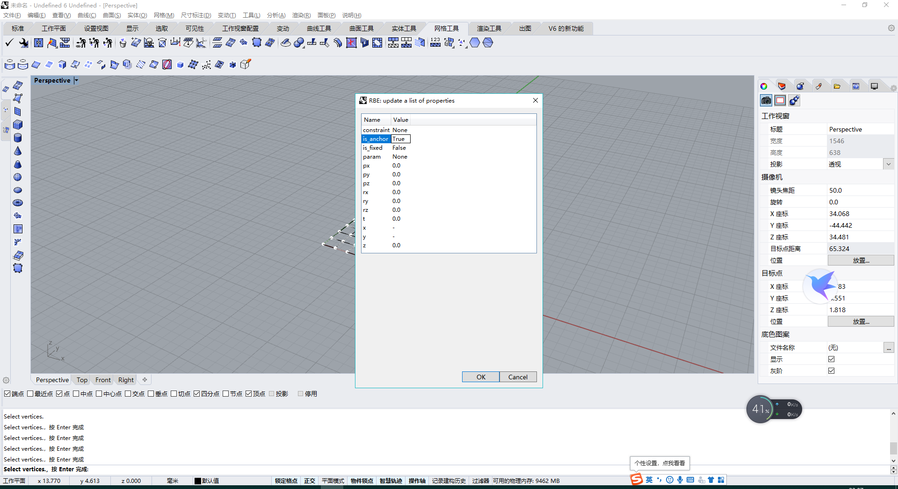
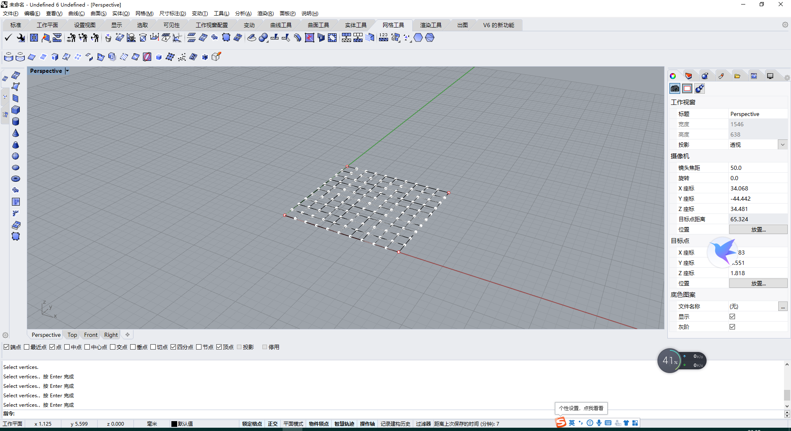

# Fixes

### 下载环境文件

https://c-t.work/s/fca20305057c49

在这个网址上下载环境包，解压，注意不要有双层目录

### 删除原DF2019环境

管理员模式进入anaconda

输入

```
conda remove -n DF2019 --all
```

### 复制新环境

打开anaconda的安装位置



进入envs文件夹，把解压出来的DF2019文件夹复制到这里



### 安装fofin—UI

以管理员进入anaconda Prompt

```
conda activate DF2019
```

打开compas_fofin—UI解压的位置

```
cd C:\ ...\compas_fofin-UI
```

输入以下两条命令

```
python -m compas_rhino.uninstall_plugin FOFIN{7ea0207d-965a-4982-abc7-f60810ae2626}
```

```
python -m compas_rhino.install_plugin FOFIN{7ea0207d-965a-4982-abc7-f60810ae2626}
```

### 在anaconda里打开proxy服务器

输入

python

再输入

```
>>>from compas.rpc import Proxy
```

```
>>>p=Proxy()
```



此时不要关闭anaconda，直接打开rhino6

### Rhino6里fofin找形

用管理员模式打开rhino6

输入命令fofin_init



在rhino里画一个网格平面



fofin_from

mesh

再选中该曲面


fofin_attributes     vertices    选中四个顶点



将is_anchor改成True



输入命令fofin_run


即得到找形结果
