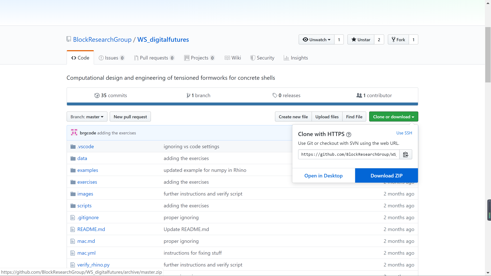
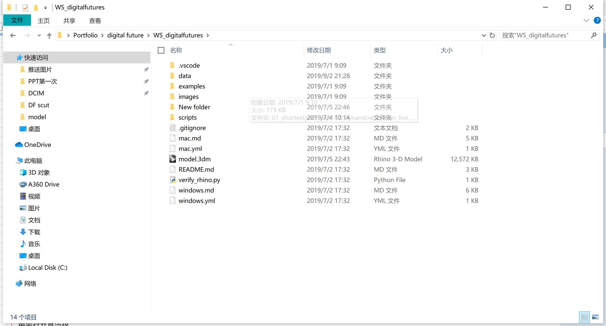
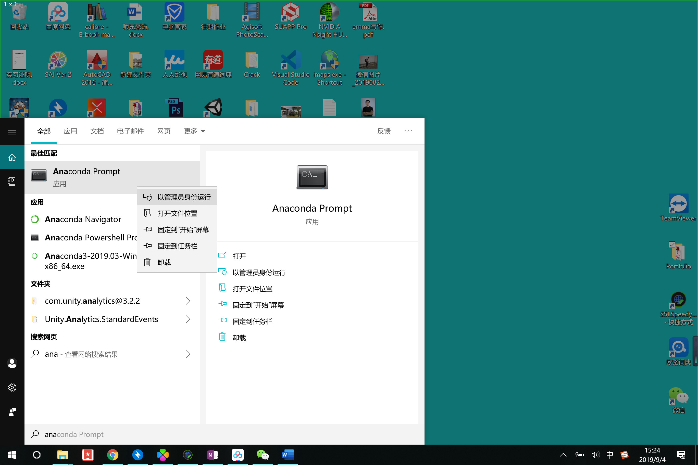
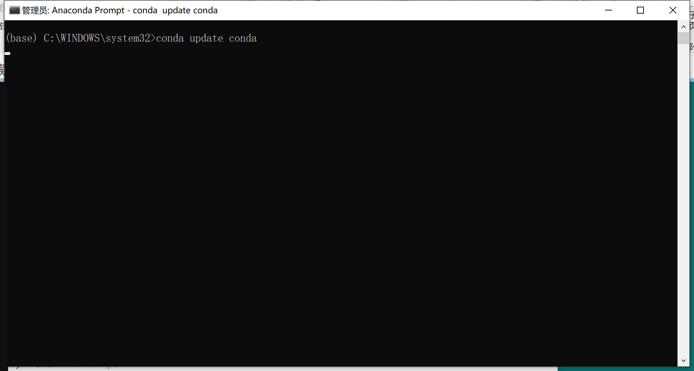
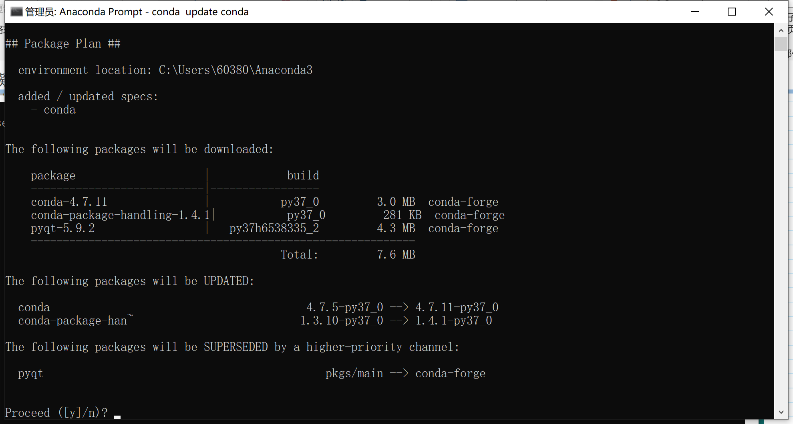
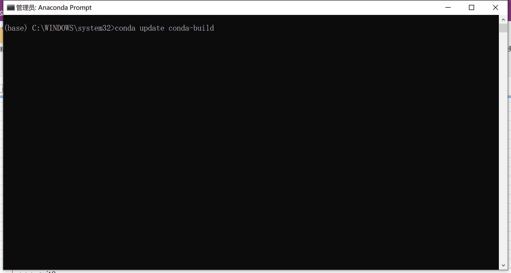
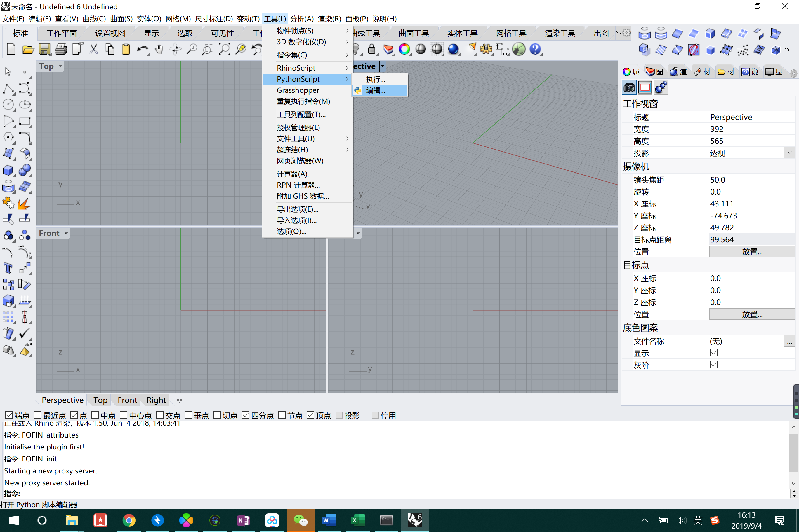
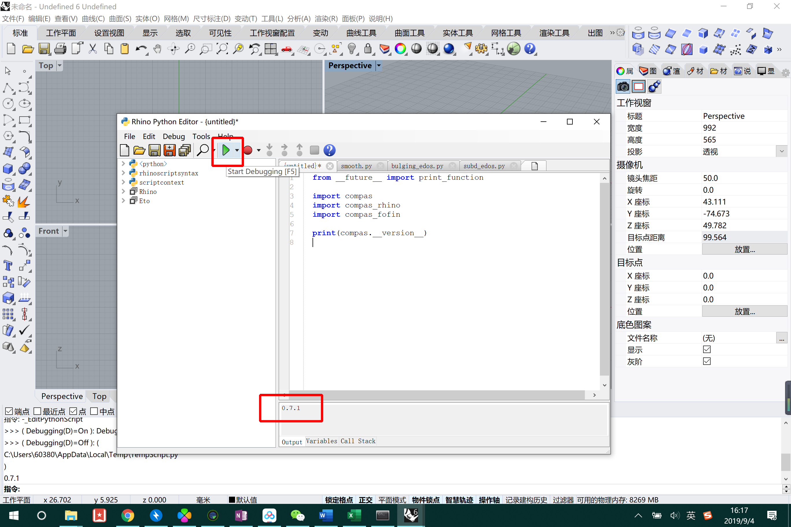

# 软件和安装教程

## 需要提前装好的软件

 

**Anaconda 3**

**Rhino6**

**Visual Studio Code**

**Git**

 

保证Anaconda装在系统盘上，推荐在 C:\Anaconda\

 

百度网盘下载地址：

 

> 链接：https://pan.baidu.com/s/1QaKgfn1xjECe7NQDKZAaBg 
>
> 提取码：97e7 
>
> 复制这段内容后打开百度网盘手机App，操作更方便哦
>

 

除了rhino6外，都是开源免费软件，不需要破解，安装时一路选择默认选项即可

 

 

## 文件下载

 

### 下载WS_digitalfutures

 

https://www.github.com/BlockResearchGroup/WS_digitalfutures. 

 

下载github文件，选择zip格式

 

 

将文件解压到**系统盘**某一文件夹下，注意将文件夹重命名为WS_digitalfutures 即去掉-master

不要出现双层重复目录，例如C:\Users\60380\Desktop\Portfolio\digital future\WS_digitalfutures (2)\WS_digitalfutures-master

 

一个正常的文件目录应该像这样C:\Users\60380\Desktop\Portfolio\digital future\WS_digitalfutures

里面打开是这样

 

 

### 下载 compas_fofin-UI

 

在 https://www.github.com/BlockResearchGroup/compas_fofin-UI 以相同方式下载zip文件，并解压和工作坊文件同样的文件夹内

 

 

## 环境安装

 

用Windows菜单栏搜索打开 Anaconda Prompt ，右键点击以管理员身份运行。

 

### 1.  update conda

 

输入 

> conda update conda
>

然后按Enter

 

弹出问题，输入y，按Enter（后面出现类似情况同理）

 

输入 

>conda update conda-build

按Enter

（在命令行模式里不要用鼠标点击任何位置，不然程序运行会自动暂停）

### 2. 注册 conda-forge

 

输入 

> conda config --add channels conda-forge
>

回车

 

### 3.创建虚拟环境

在annaconda里创建一个虚拟环境，并且安装numpy和pip

输入

>conda create -n DF2019 python=3.6 numpy=1.15.4 pip

回车

（创建环境是为了环境与环境之间不相互干扰，即使你的这个环境崩溃了也不会影响到base环境的稳定性，不需要整体重装）

 

### 4.启用该环境

 

输入

>conda activate DF2019

回车

 

以下所有操作都在 DF2019 环境中运行，如果中途关闭，重新进入时仍然需要进行这一步骤

 

### 5.安装compas和compas_fofin

分别输入以下两行代码并按回车

 

>conda install COMPAS=0.7.1

 

> pip install git+https://www.github.com/BlockResearchGroup/compas_fofin.git#egg=compas_fofin --upgrade
>

 

### 6.检验compas的安装

输入

>python

回车

 

输入

>\>>> import compas

>\>>> import compas_plotters

>\>>> compas.____version____

每行一回车，”>>>“不需要输入

 

看输出结果是否为：

>\'0.7.1'

 

输入

>\>>> exit()

 

### 7.安装compas_fofin到rhino

分别输入以下两行代码并按回车

 

>python -m compas_rhino.uninstall

 

>python -m compas_rhino.install

 

>python -m compas_rhino.install -p compas_fofin

 

>python -m compas_rhino.uninstall_plugin FOFIN{7ea0207d-965a-4982-abc7-f60810ae2626}

 

>python -m compas_rhino.install_plugin FOFIN{7ea0207d-965a-4982-abc7-f60810ae2626}

 

### 8.检验Rhino里compas的安装

 

 

打开Rhino，输入命令 EditPythonScript，或者用鼠标 工具——PythonScript——编辑 打开。

打开工作坊文件里的verify_rhino.py，或者直接在编辑栏里输入以下代码。

 

> from __future__ import print_function
>
>  
>
> import compas
>
> import compas_rhino
>
> import compas_fofin
>
>  
>
> print(compas.__version__)
>

 

点击绿色“播放”按钮，如果输出栏显示0.7.1，表明安装成功。

 

 

 

 
