# 预算物料表

## 面料

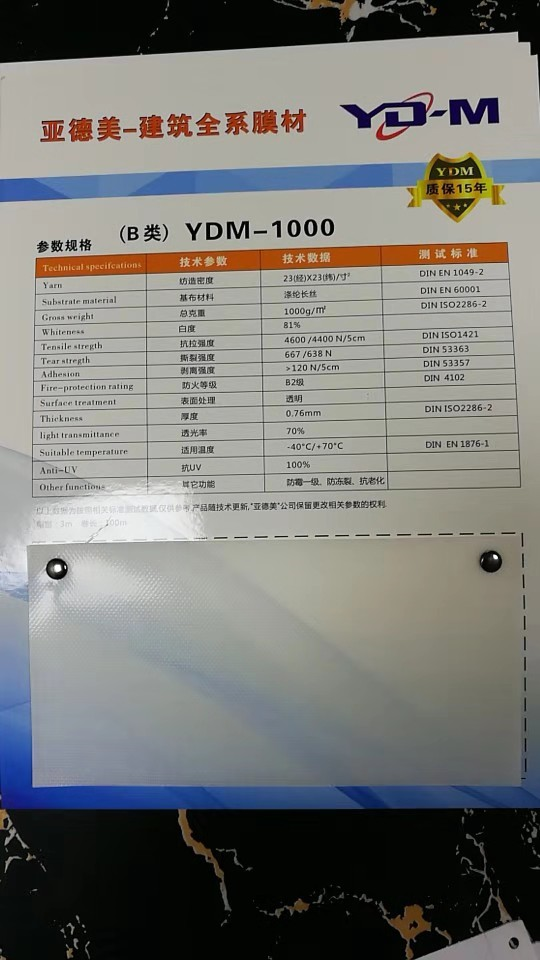

45元/平米

同济用16平米

大概共需要30平米

45*30=1350元

定位打印费

 500元

## 五金件

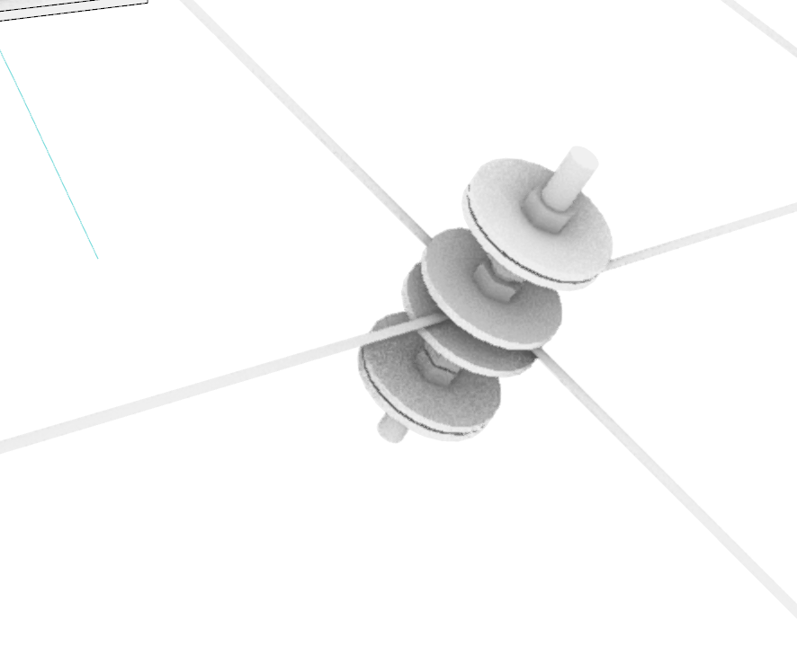

### 垫片 

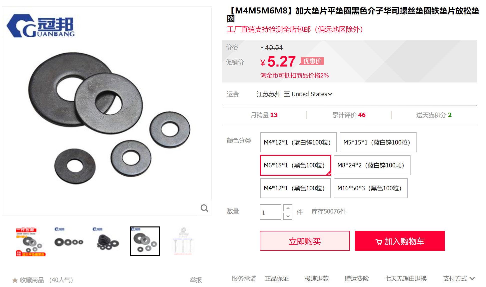

同济用1722个

算2500个

2500*5.27/100≈150元

### 螺杆

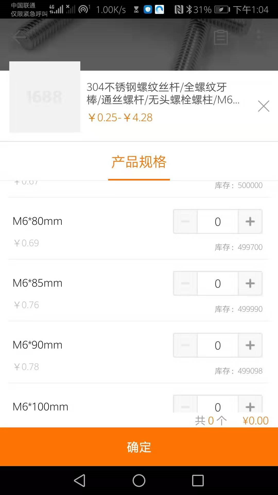

同济用287个

算400个

400*0.69=276元≈300元

### 螺母

同济用 1772个

算2500个

2500*0.06=150元

### 钢索

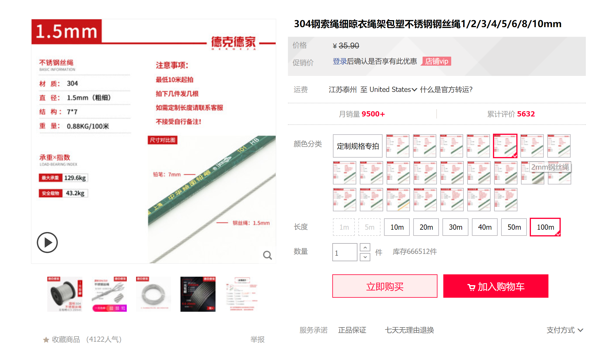

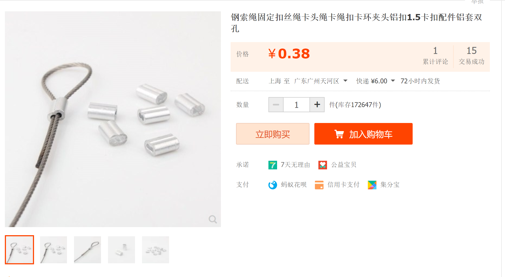

同济用136米

算200米 2*35=70元，约为100元

### 拉紧器

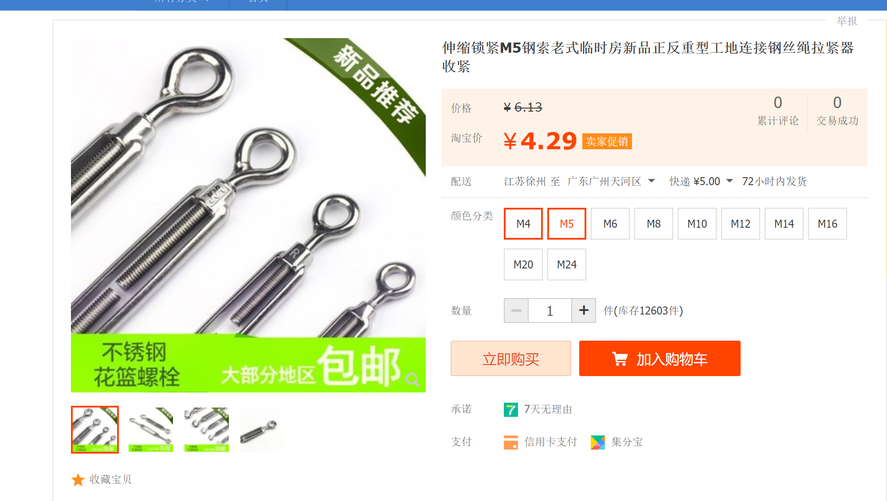

约需要40个

40*4.29=200元

### 自攻螺丝钉

200个 大约需要50块

### 打钉器钉子

3盒 大约需要100元

## 封边

### 底部封边

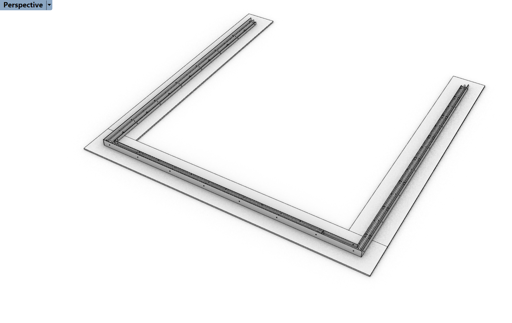

需要改用木条解决 200元

### 顶部封边

木条解决 100元

## 水泥

免费

## 缝合

### 人工费

500元

### 补充缝合

手持缝纫机 30元

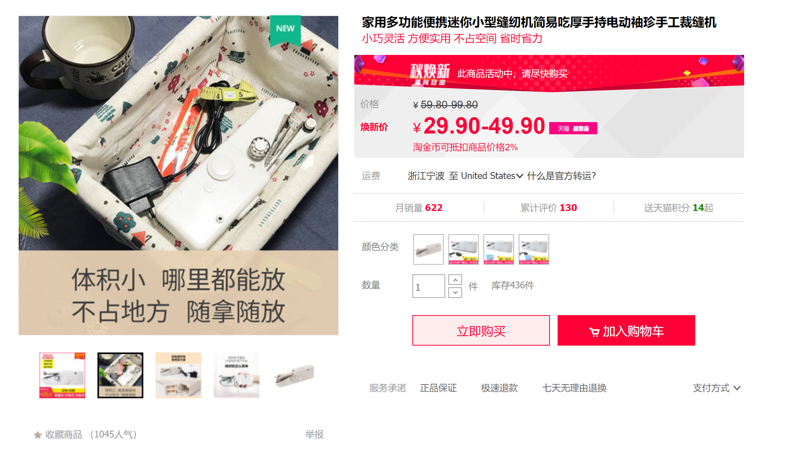

### 缝纫线

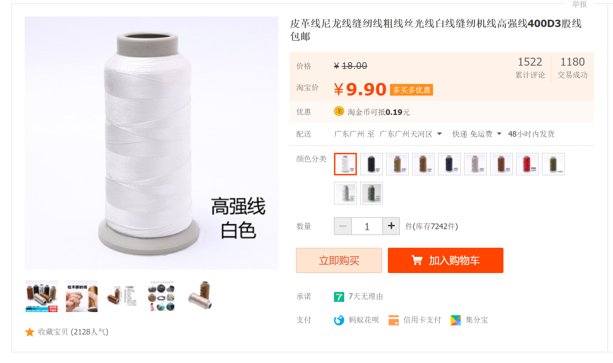

20卷 200元

## 框架

### 木方

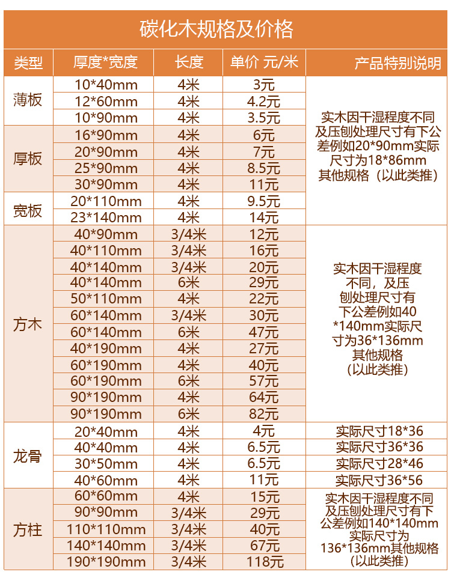

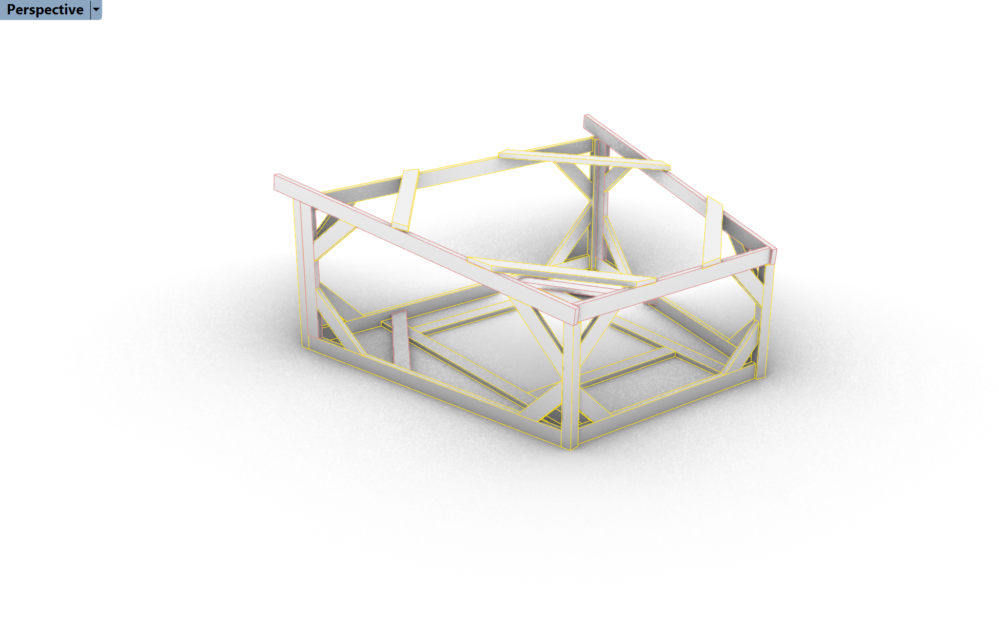

10*10 3m 2根 80元

50*150 16根 16x30=480元

预算表

| 大类   | 小类           | 金额 |
| ------ | -------------- | ---- |
| 面料   | 材料           | 1350 |
|        | 定位打印费     | 500  |
| 五金件 | 垫片           | 150  |
|        | 螺杆           | 300  |
|        | 螺母           | 150  |
|        | 钢索           | 100  |
|        | 拉紧器         | 200  |
|        | 自攻螺丝       | 50   |
|        | 打钉器钉子     | 100  |
|        | 底部封边       | 200  |
|        | 顶部封边       | 100  |
| 水泥   | 水泥和减水剂等 | 0    |
| 缝合   | 人工费         | 500  |
|        | 手持缝纫机     | 30   |
|        | 缝纫线         | 200  |
| 框架   | 100*100        | 80   |
|        | 50*150         | 480  |
|        |                |      |
| 总计   |                | 4490 |